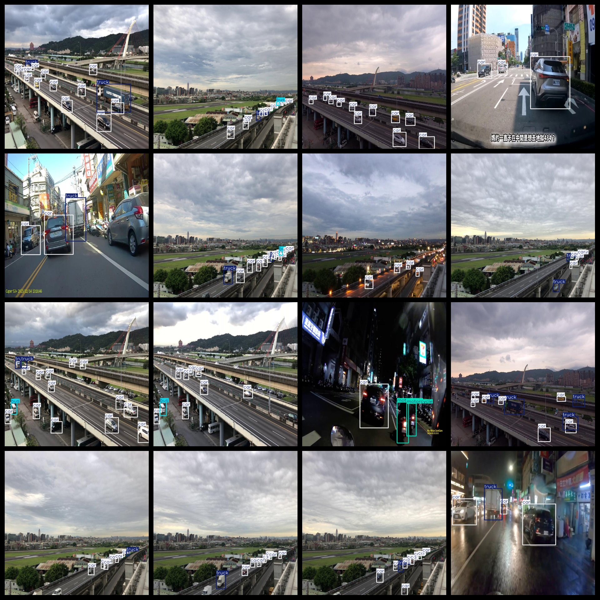
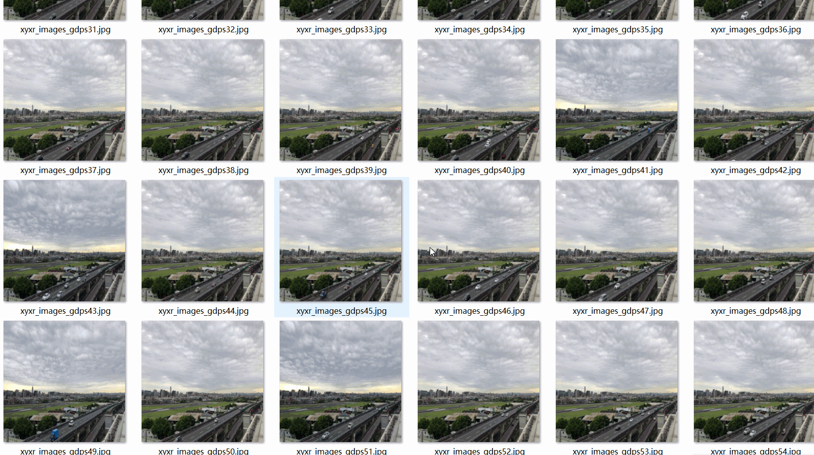

# Fixed View Captured Highway Vehicle Dataset: 5236 Images in VOC+YOLO Format

This dataset captures highway vehicles from a fixed viewpoint, comprising 5236 images in VOC and YOLO format. The dataset is organized into three folders for storing images, xml files, and txt files. Within the JPEGImages folder, there are a total of 5236 jpg images. The Annotations folder contains a total of 5236 xml files, while the labels folder has 5236 txt files. There are a total of 5 categories in this dataset: "bicycle", "bus", "car", "motorcycle", and "truck". The Chinese translation for these labels is provided below:

- bicycle
- bus
- car
- motorcycle
- truck

The number of boxes (yolo format) per category is as follows:

- bicycle = 76
- bus = 1489
- car = 47407
- motorcycle = 2624
- truck = 6306

The total number of boxes is 57902.

The image resolution is clear with a pixel count.

Images have not been enhanced.

Label shapes are square boxes used for target detection recognition.

Important Notes: No guarantees are made regarding the accuracy or weights of the trained models or files. The dataset is only provided for accurate and reasonable annotation.

Annotation and Image Details:

## Images

---

Here is a pay link on Stripe (https://buy.stripe.com/3cs8yP7sY87d0vu9AB). Please contact me lonlonago@foxmail.com after funding $89, and I will send you a complete data files, thank you!

